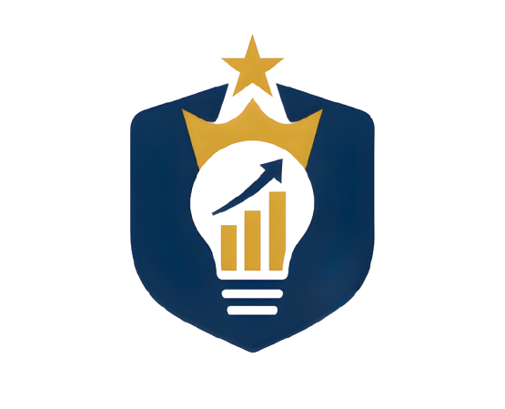

<div align="center">
  
# 🚀 NBPC-UNISNU 🚀



### Website Resmi National Business Plan Competition

[](https://nextjs.org/)
[](https://reactjs.org/)
[](https://tailwindcss.com/)
[](https://www.framer.com/motion/)

</div>

---

## 📋 Tentang Proyek

Website resmi untuk **National Business Plan Competition (NBPC)** Universitas Islam Nahdlatul Ulama (UNISNU) Jepara. Platform ini didesain untuk memberikan pengalaman terbaik bagi peserta lomba, dengan tampilan yang modern dan fitur interaktif.

<div align="center">
  
  > 💡 *"Mendorong Inovasi dan Kewirausahaan Mahasiswa Indonesia"*

</div>

## ✨ Fitur Utama

<table>
  <tr>
    <td>
      <h3>🏠 Halaman Beranda</h3>
      <ul>
        <li>Hero section dengan animasi dinamis</li>
        <li>Timeline acara dengan visualisasi menarik</li>
        <li>Sponsor dan testimonial peserta</li>
      </ul>
    </td>
    <td>
      <h3>🏆 Halaman Lomba</h3>
      <ul>
        <li>Detail kategori lomba dengan popup interaktif</li>
        <li>Timeline pendaftaran dengan progress visual</li>
        <li>FAQ dan panduan peserta</li>
      </ul>
    </td>
  </tr>
  <tr>
    <td>
      <h3>👥 Halaman Tentang</h3>
      <ul>
        <li>Profil tim penyelenggara dengan popup detail</li>
        <li>Sejarah dan visi NBPC</li>
        <li>Galeri kegiatan tahun sebelumnya</li>
      </ul>
    </td>
    <td>
      <h3>✅ Lainnya</h3>
      <ul>
        <li>UI/UX yang modern dan responsif</li>
        <li>Performa yang dioptimalkan</li>
        <li>Animasi halus dengan Framer Motion</li>
      </ul>
    </td>
  </tr>
</table>

<!-- Tambahkan screenshot website di sini -->
<!-- <div align="center">
  
  
</div> -->

## 🧰 Teknologi

- **Framework**: Next.js 15
- **Frontend**: React, Tailwind CSS
- **Animasi**: Framer Motion
- **Deployment**: Vercel

## 🚀 Memulai Pengembangan

```bash
# Clone repository
git clone https://github.com/A-wisnu/NBPC-UNISNU.git
cd NBPC-UNISNU

# Install dependencies
npm install

# Jalankan server pengembangan
npm run dev
```

Buka [http://localhost:3000](http://localhost:3000) di browser Anda untuk melihat hasilnya.

## 📝 Struktur Proyek

```
NBPC-UNISNU/
├── public/             # File statis (gambar, icon)
├── src/
│   ├── app/            # Halaman utama (Next.js App Router)
│   │   ├── lomba/      # Halaman kompetisi
│   │   ├── tentang/    # Halaman tentang
│   │   └── daftar/     # Halaman pendaftaran
│   ├── components/     # Komponen React
│   └── styles/         # CSS dan styling
└── ...
```

## 👨‍💻 Tim Pengembang

Website ini dikembangkan oleh tim IT NBPC UNISNU Jepara.

---

<div align="center">
  
  <p>© 2025 NBPC UNISNU. Hak Cipta Dilindungi.</p>
  
  <a href="https://github.com/A-wisnu/NBPC-UNISNU">
    
  </a>
  
</div>
